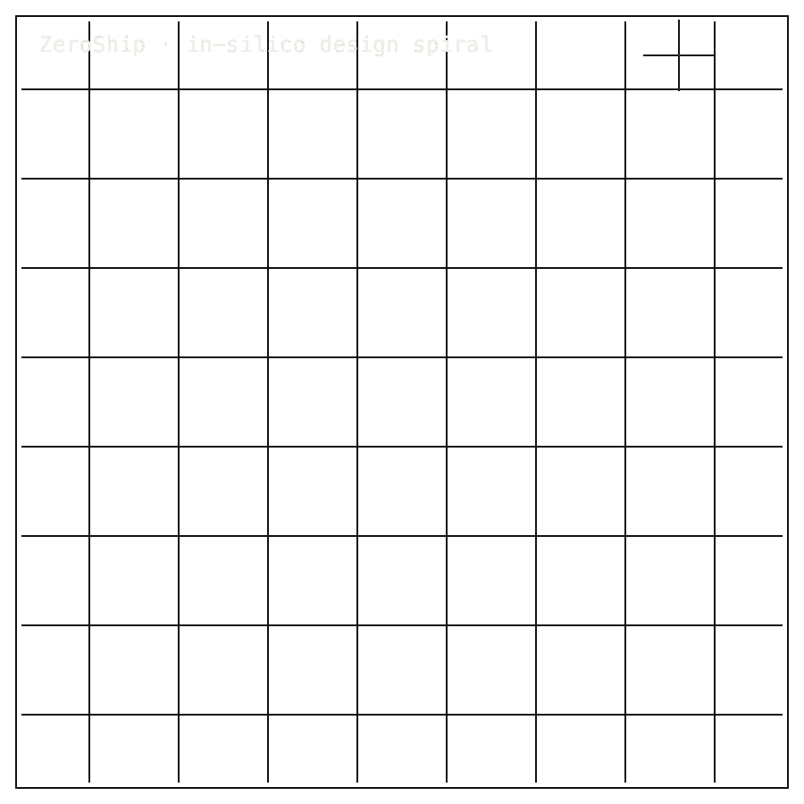

# ZeroShip

## 0. Install / Developer Commands

#### Quick Start

```bash
git clone https://github.com/Zer0pa/ZeroShip.git
cd ZeroShip
sed -n '1,220p' README.md
sed -n '1,240p' DEVELOPMENT-STATUS.md
find proofs -maxdepth 3 -type f | sort
```

<table>
<tr>
<td colspan="7" valign="top">
<sub>01 · Bento cell · b-cell b-hero cell-7 row-2</sub>
<div><span><b>00 · ZEROSHIP</b> · SHIP DESIGN SPIRAL</span><span>RESEARCH-READY · V_01–V_04 PASS</span></div>
      <h1>MIT Ship Design Spiral, <span>In-Silico</span></h1>
      <p>Five-discipline design spiral &middot; <em>ZeroShip</em> &middot; Hull 20098 proving article &middot; github.com/Zer0pa/ZeroShip</p>
      <p>Global shipping carries <strong>roughly 80% of world trade</strong> and still burns the dirtiest fuel afloat. ZeroShip is the in-silico form of the MIT design spiral &mdash; hydrodynamics, propulsion, structure, arrangement, stability &mdash; running on one vessel concept until every discipline agrees on the same ship. Hull 20098, a <strong>10,955-tonne hydrogen-electric freighter</strong> at <strong>14.36 MW</strong> installed power and <strong>23 knots</strong> service speed, is the first public proving article. The page shows what the spiral converged on, and what it has not yet been asked to answer.</p>
</td>
<td colspan="5" valign="top">
<sub>02 · ZeroShip animated mechanics diagram · b-cell b-codec-mechanics cell-5 row-2</sub>
<figure>
        <div></div>
        <figcaption><b>Scope:</b> in-silico design spiral around Hull 20098. V_01-V_04 pass, with certification and full design closure outside this claim.</figcaption>
      </figure>
</td>
</tr>
<tr>
<td colspan="4" valign="top">
<sub>03 · Bento cell · b-cell b-title cell-4</sub>
<div><b>01 · THE GAP</b><span>READING IN SEQUENCE</span></div>
      <h2>Five disciplines have always read the hull. Never simultaneously. Never from the same vessel concept.</h2>
</td>
<td colspan="5" valign="top">
<sub>04 · Bento cell · b-cell b-fig cell-5</sub>
<div><b>02 · MARKETS</b><span>ADJACENT FORECASTS</span></div>
      <div>
        <div>
          <div><span>Maritime decarbonization &mdash; '30</span><span></span><span>$52.7B</span></div>
          <div><span>Hydrogen generation &mdash; '30</span><span></span><span>$316.5B</span></div>
          <div><span>Fuel-cell market &mdash; '30</span><span></span><span>$17.9B</span></div>
          <div><span>Marine engineering software &mdash; '30</span><span></span><span>$9.8B</span></div>
          <div><span>Green shipping tech &mdash; '31</span><span></span><span>$79.4B</span></div>
        </div>
      </div>
      <div>Adjacent transition forecasts. ZeroShip sits beneath them as the design workspace where every discipline reads the same hydrogen-electric ship.</div>
</td>
<td colspan="3" valign="top">
<sub>05 · Bento cell · b-cell b-stat cell-3</sub>
<div><b>03 · VALUE</b></div>
      <div>$79.4<span>B</span></div>
      <div>Green shipping '31 forecast; an integrated five-discipline design workspace beneath it remains largely unpriced.</div>
</td>
</tr>
<tr>
<td colspan="3" valign="top">
<sub>06 · Bento cell · b-cell b-title is-centered cell-3</sub>
<div><b>04 · INSIGHT</b></div>
      <h2>Iterate the spiral enough, the disagreements stop &mdash; <span>that is the ship.</span></h2>
</td>
</tr>
<tr>
<td colspan="12" valign="top">
<sub>07 · Bento cell · b-cell b-prose is-technical b-tech-panel</sub>
<div><b>05.1 · CURRENT TECH</b><span>READING IN SEQUENCE</span></div>
        <p>Ship design still runs each discipline in turn &mdash; hydrodynamics, then propulsion, then structure, then stability. By the time they all weigh in, the first assumptions are already stale and every team has answered a slightly different ship.</p>
</td>
</tr>
<tr>
<td colspan="12" valign="top">
<sub>08 · Bento cell · b-cell b-prose is-technical b-tech-panel</sub>
<div><b>05.2 · OUR TECH</b><span>ONE LOOP, FIVE DISCIPLINES</span></div>
        <p>ZeroShip runs all five through the same loop &mdash; hydrodynamics, propulsion, structure, arrangement, stability &mdash; each pass informing the next until the design converges on one ship. Hull 20098 sits in the loop today at <strong>10,955 tonnes</strong>, <strong>14.36 MW</strong> installed power, and <strong>23 knots</strong> service speed; the page also names where the spiral has not yet been run.</p>
</td>
</tr>
<tr>
<td colspan="3" valign="top">
<sub>09 · Bento cell · b-cell b-fig b-benchmark-mini cell-3</sub>
<div><b>05.3 · BENCHMARKS</b><span>PLATFORM SURFACE</span></div>
      <div>
        <div>
          <div><span>V_01</span><b>README</b><small>public packet</small></div>
          <div><span>V_04</span><b>packet</b><small>boundary check</small></div>
          <div><span>Dimensions</span><b>15</b><small>platform</small></div>
          <div><span>Services</span><b>6</b><small>cross-cutting</small></div>
        </div>
        <div>
          <div><span>V_01</span><span></span><span>PASS</span></div>
          <div><span>V_02 / V_03</span><span></span><span>PASS</span></div>
          <div><span>V_04</span><span></span><span>PASS</span></div>
        </div>
      </div>
      <div><b>On the page:</b> what the platform is and where it stands &mdash; no private hull performance, no live-engine claim.</div>
</td>
<td colspan="4" valign="top">
<sub>10 · Bento cell · b-cell b-title cell-4</sub>
<div><b>06 · MEASUREMENT</b><span>V_01–V_04 SUITE</span></div>
      <h2>Four passes. The spiral names what holds and <span>what does not.</span></h2>
</td>
</tr>
<tr>
<td colspan="8" valign="top">
<sub>11 · Bento cell · b-cell b-fig cell-8</sub>
<div><b>06.1 · VERIFICATION RESULTS &middot; V_01–V_04</b></div>
      <div>
        <div>
          <div><span>V_01 README</span><span></span><span>PASS</span></div>
          <div><span>V_02 anchors</span><span></span><span>PASS</span></div>
          <div><span>V_03 status packet</span><span></span><span>PASS</span></div>
          <div><span>V_04 exclusions</span><span></span><span>PASS</span></div>
        </div>
      </div>
      <div>Four passes covering the public-facing platform: what it is, where it stands, and what it deliberately holds back. Private performance models, classification certification, and a delivered hydrogen-electric hull are not yet on the page.</div>
</td>
</tr>
<tr>
<td colspan="12" valign="top">
<sub>12 · Bento cell · b-cell b-row-label cell-12</sub>
<div><b>07 · KEY METRICS</b><span>SPIRAL DIMENSIONS</span></div>
</td>
</tr>
<tr>
<td colspan="12" valign="top">
<sub>13 · Bento cell · b-cell b-stat</sub>
<div><b>07.1 · DIMENSIONS</b></div>
      <div>15</div>
      <div>naval-architecture domains &middot; <b>each one reads the same ship</b></div>
</td>
</tr>
<tr>
<td colspan="12" valign="top">
<sub>14 · Bento cell · b-cell b-stat</sub>
<div><b>07.2 · SERVICES</b></div>
      <div>6</div>
      <div>shared services every domain leans on &middot; <b>geometry, units, runs, evidence</b></div>
</td>
</tr>
<tr>
<td colspan="12" valign="top">
<sub>15 · Bento cell · b-cell b-stat</sub>
<div><b>07.3 · CASES</b></div>
      <div>7</div>
      <div>vessel concepts named in public &middot; <b>Hull 20098 is the first proven</b></div>
</td>
</tr>
<tr>
<td colspan="12" valign="top">
<sub>16 · Bento cell · b-cell b-stat</sub>
<div><b>07.4 · VERIFICATIONS</b></div>
      <div>V_01&ndash;V_04</div>
      <div>all four passes against the public page &middot; <b>what is in, what is held back</b></div>
</td>
</tr>
<tr>
<td colspan="12" valign="top">
<sub>17 · Bento cell · b-cell b-stat</sub>
<div><b>07.5 · ROLES</b></div>
      <div>3</div>
      <div>page, repo, evidence packet &middot; <b>live engine held private</b></div>
</td>
</tr>
<tr>
<td colspan="4" valign="top">
<sub>18 · Bento cell · b-cell b-title is-centered cell-4</sub>
<div><b>08 · THE SPIRAL'S SCOPE</b><span>WHAT THE SURFACE SHOWS</span></div>
      <h2>The spiral governs what is public &mdash; <span>and what is not.</span></h2>
</td>
<td colspan="5" valign="top">
<sub>19 · Bento cell · b-cell b-prose is-technical cell-5</sub>
<div><b>08.1 · WHAT THE SPIRAL SHOWS PUBLICLY</b><span>ARCHITECTURE AND BOUNDARY</span></div>
      <p>ZeroShip is the in-silico form of the MIT design spiral: five disciplines &mdash; hydrodynamics, propulsion, structure, arrangement, stability &mdash; cycling through the same vessel concept, each pass informing the next. The public page describes how the platform is organised, where Hull 20098 currently stands, and what the spiral is not yet claiming. Implementation source, detailed geometry, flow-analysis archives, OEM and partner data, and live engine operation stay private. A reviewer reads the shape of the spiral and a checked list of what is held back &mdash; not the working files behind it.</p>
</td>
<td colspan="3" valign="top">
<sub>20 · Bento cell · b-cell b-blocker cell-3</sub>
<div><b>08.2 · THE FIDELITY GAP</b></div>
      <span>Honest Blocker &middot;</span>
      <p><em>No public implementation code, no package manifest, no PyPI project, no wheel, no command-line tool, no hosted service, no private geometry, no flow-analysis archives, no OEM data, no partner data, no vessel-status promotion, and no authorized restart of the live engine.</em> Copy cannot close this boundary; named public evidence must.</p>
</td>
</tr>
<tr>
<td colspan="4" valign="top">
<sub>21 · Bento cell · b-cell b-title cell-4</sub>
<div><b>09</b></div>
      <h2>FIVE DISCIPLINES, ONE <span>SHIP.</span></h2>
</td>
<td colspan="4" valign="top">
<sub>22 · Bento cell · b-cell b-prose cell-4</sub>
<div><b>09.1 · THE AMBITION</b></div>
      <p>The aim is a shared design workspace where hydrodynamics, propulsion, structure, arrangement, and stability pass through one in-silico spiral until a hydrogen-electric vessel coheres. Hull 20098 is the proving article. What it lets a yard, a class society, or a financier do depends on the public evidence still being built.</p>
</td>
</tr>
<tr>
<td colspan="12" valign="top">
<sub>23 · Bento cell · b-cell b-title b-statement-card</sub>
<div><b>09.2 · WHAT WORKS NOW</b></div>
        <h2>Working now: published platform architecture, current status, exclusion boundary, and four public-boundary checks passed.</h2>
</td>
</tr>
<tr>
<td colspan="12" valign="top">
<sub>24 · Bento cell · b-cell b-title b-statement-card</sub>
<div><b>09.3 · WHAT'S STILL OPEN</b></div>
        <h2>Still open: implementation source, hosted service, private geometry and flow archives, and authorized restart of the live engine.</h2>
</td>
</tr>
<tr>
<td colspan="12" valign="top">
<sub>25 · Bento cell · b-cell b-unlock</sub>
<div><b>09.4</b> &middot; DESIGN REVIEW · NEAR-TERM (12–24 MO)</div>
      <div>Concepts fail before the cheque clears</div><div>A naval architect can kill the wrong hull before procurement opens a hydrogen-vessel line item. When the discipline that would break the design breaks it in the spiral, the shipyard never quotes steel for a concept that could not survive its own physics.</div>
</td>
</tr>
<tr>
<td colspan="12" valign="top">
<sub>26 · Bento cell · b-cell b-unlock</sub>
<div><b>09.5</b> &middot; PROCUREMENT · NEAR-TERM (12–24 MO)</div>
      <div>One ship five disciplines can argue about</div><div>A maritime procurement lead stops chasing five separate consultant reports that read five different versions of the same vessel. Hydrodynamics, propulsion, structure, arrangement, and stability all answer from the same hull, so tradeoffs become one decision instead of five.</div>
</td>
</tr>
<tr>
<td colspan="12" valign="top">
<sub>27 · Bento cell · b-cell b-unlock</sub>
<div><b>09.6</b> &middot; CLASS AND COMPLIANCE · MID-TERM (24–48 MO)</div>
      <div>Class society reads design and compliance together</div><div>A classification-society reviewer receives a vessel concept whose compliance evidence lives inside the design history, not stapled to it afterward. The first authority conversation about a hydrogen-electric freighter starts from a shared record of what was tested and what was excluded.</div>
</td>
</tr>
<tr>
<td colspan="12" valign="top">
<sub>28 · Bento cell · b-cell b-unlock</sub>
<div><b>09.7</b> &middot; TRANSITION ECONOMICS · MID-TERM (24–48 MO)</div>
      <div>Hydrogen vessel claims arrive with cost receipts</div><div>A decarbonization-fund officer can ask whether a hydrogen-electric freighter pencils out and get an answer from the same loop that sized its propulsion. Capital allocators stop choosing between physics credibility and economic credibility &mdash; the spiral carries both.</div>
</td>
</tr>
<tr>
<td colspan="12" valign="top">
<sub>29 · Bento cell · b-cell b-unlock</sub>
<div><b>09.8</b> &middot; MARITIME R&amp;D · PARADIGM (48 MO+)</div>
      <div>A ship design becomes a regulated dossier</div><div>Early vessel R&amp;D stops looking like marketing renderings and starts looking like a retained evidence object that regulators, insurers, financiers, and yards can interrogate years apart. The unit of trust in maritime transition shifts from the slide deck to the design dossier itself.</div>
</td>
</tr>
</table>
