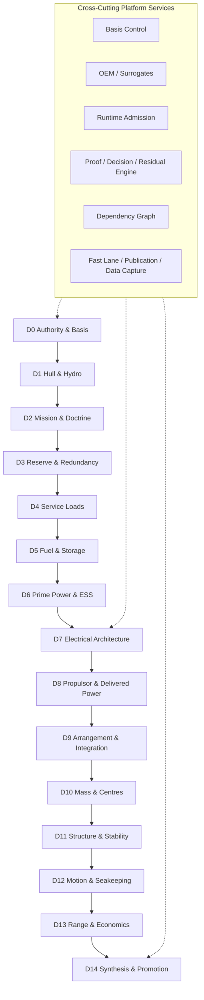

# System Architecture

> Source: `workstreams/ws-arch/architecture/ARCH-001-zeroship-end-to-end-architecture.md`

## Platform Definition

ZeroShip is a ship-first, physics-governed engineering platform for taking a vessel from frozen basis to integrated ship closure across the full MIT ship spiral. The platform holds:

- Vessel basis and frozen specimen
- Hydrodynamic truth surface
- Machinery, electrical, and propulsor architecture
- Arrangement, mass, structure, stability, and class interfaces
- Motion, seakeeping, augmentation, and operational economics
- Runtime, evidence, residual, and publication law

The platform produces vessel-design outputs. The ship is the proving article; the platform is the reusable machine extracted from repeatedly designing the ship well.

## Whole-Platform View

## MIT Ship Spiral Mapping

| Classic Ship-Spiral Theme | ZeroShip Dimensions | Platform Meaning |
|---------------------------|---------------------|------------------|
| Authority and requirements | D0–D2 | Freeze what ship is being designed, basis, operating doctrine |
| Margins and service doctrine | D3–D4 | Turn vague reserve and hotel assumptions into explicit engineering inputs |
| Energy, storage, and plant | D5–D7 | Define vessel's storage mode, plant architecture, ESS role, electrical system |
| Propulsion and physical embodiment | D8–D9 | Translate installed power into supported speed, fit ship internally as buildable machine |
| Weights, stability, and class | D10–D11 | Close mass book, centre book, structural posture, damage logic, class-facing package |
| Dynamics and modifiers | D12 | Evaluate motion, seakeeping, hydrodynamic modifiers on integrated ship |
| Operations and economics | D13 | Turn integrated vessel into route, range, endurance, economic answer |
| Synthesis and comparison | D14 | Compare baseline and challengers on one basis, emit governed verdict |

## D0 — Authority, Basis, Chronology

**Platform surfaces:** basis registry, frozen specimen manifest, challenger registry, dead-prior register, lane rules, authority stack

**Ship question:** Which ship is active, which challengers are live, which assumptions are dead, which evidence surfaces are allowed to govern?

**Outputs:** One lawful basis hash and one consistent source hierarchy.

## D1 — Hull And Hydrodynamic Specimen

**Platform surfaces:** hull truth surface, hydrodynamic anchor pack, modifier registry, geometry reopen gate, hull residual ledger

**Ship question:** Which hull line is being embodied, and which hydrodynamic modifiers remain modifiers rather than new baseline geometry?

**Outputs:** One frozen specimen plus controlled register of coatings, flow-control rows, stern devices, bounded drag modifiers.

## D2 — Mission And Operating Doctrine

**Platform surfaces:** mission basis, operating-profile set, speed doctrine, route-family set, port or standby assumptions

**Ship question:** Is the vessel optimized for gate speed, economic speed, route family, schedule recovery, or a different doctrine?

**Outputs:** Machine-readable mission model that every later power/storage/economics calculation inherits.

## D3 — Reserve And Redundancy Doctrine

**Platform surfaces:** reserve doctrine, casualty requirement matrix, common-mode policy, black-start philosophy, degraded-speed targets

**Ship question:** What must the ship survive after a module loss, pod loss, bus separation, or black-start event?

**Outputs:** Explicit reserve rules feeding plant sizing, ESS role, electrical segmentation, casualty-speed logic.

## D4 — Service-Load Model

**Platform surfaces:** itemized service-load book, underway and port load cases, emergency load cases, transient factors, load-shedding hierarchy

**Ship question:** Beyond propulsion, what does the ship continuously and intermittently need to power?

**Outputs:** One itemized service-load model feeding plant, electrical, and range calculations.

## D5 — Fuel And Storage Basis

**Platform surfaces:** storage basis, tankage cases, usable-energy cases, storage-system mass/volume breakdowns, grouping logic, storage residuals

**Ship question:** What is the primary storage mode, how much usable energy is carried, how is it grouped, what is the hazard envelope?

**Outputs:** One explicit storage basis inherited by plant, arrangement, mass, class, economics calculations.

## D6 — Prime Power, ESS Role, And Module Zoning

**Platform surfaces:** plant architecture, module count and zoning, ESS role contract, ESS size band, cooling architecture, vendor-position rows

**Ship question:** What is installed plant, how is it split into modules and zones, what is ESS there to do, what is the cooling burden?

**Outputs:** One machinery architecture explicit enough to feed electrical design, arrangement, mass, casualty logic.

## D7 — Electrical Architecture And Control

**Platform surfaces:** single-line diagram, bus family, split-bus and segmentation rules, converter architecture, black-start path, protection logic, emergency bus logic, load-shedding policy

**Ship question:** How is electrical power produced, routed, protected, restarted, and degraded without confusing one failure domain with another?

**Outputs:** Electrical architecture feeding delivered-power mapping, machinery arrangement, safety design, class-facing interfaces.

## D8 — Propulsor Topology, Delivered Power, And Casualty Transmission

**Platform surfaces:** propulsor trade matrix, delivered-power map, propulsor-efficiency chain, manoeuvring assumptions, casualty-speed matrix

**Ship question:** What propulsor family is fitted, how efficient is the full chain from plant to thrust, what speed survives module or propulsor loss?

**Outputs:** One same-basis propulsor architecture comparable against challengers.

## D9 — Machinery Integration, General Arrangement, Routing, And Hazard

**Platform surfaces:** arrangement integration map, general arrangement results, routing continuity map, hazard interface map, maintenance matrix, removal paths, deckhouse/accommodation interfaces, upper-ship cargo interfaces

**Ship question:** Where do tanks, fuel cells, batteries, cooling, converters, propulsor machinery, cargo, bridge, accommodation, and service routes actually go?

**Outputs:** One physical integration surface connecting lower ship, upper ship, cargo, machinery, and hazardous boundaries.

## D10 — Mass Build-Up, Centres, Loading, And Tankage

**Platform surfaces:** mass book, centres book, loading-case set, tank fill matrix, ballast logic, cargo distributions, reinvestment cases

**Ship question:** What does the ship weigh light and loaded, where are masses located, how do cargo/fuel/ballast/consumables shift vessel state?

**Outputs:** One controlled set of weight and centre states for stability, motion, route, economics work.

## D11 — Structure, Stability, Damage, And Class-Facing Package

**Platform surfaces:** structure package, intact and damage stability results, compartmentation logic, support assumptions, class gap register, yard release boundary

**Ship question:** Does the ship remain structurally credible, stable, and compartmented across loading states and hazard assumptions?

**Outputs:** One class-facing posture stating what is closed, what is conditional, what remains an explicit gap.

## D12 — Motion, Seakeeping, And Augmentation Verification

**Platform surfaces:** motion case matrix, seakeeping case matrix, motion/seakeeping results, augmentation promotion report, route-weather interface, runtime gap register

**Ship question:** How does the ship move in waves, what added resistance and operability penalties appear, which modifiers survive ship-specific verification?

**Outputs:** One dynamic-behaviour envelope plus governed promotion/hold/kill result for modifiers.

## D13 — Range, Route, Endurance, And Economics

**Platform surfaces:** range matrix, route-sensitivity set, economic-speed report, cargo-range trade matrix, weather-duty factors, endurance cases

**Ship question:** What distance can the ship cover, at which speed, on which route families, with what reserve doctrine, at what cargo/economic consequence?

**Outputs:** One operational picture separating gate speed from economic speed and saved-mass/reinvestment/route scenarios.

## D14 — Synthesis, Promotion, And Residual Closure

**Platform surfaces:** same-basis comparison engine, promotion log, residual ledger, cycle decision brief, challenger status, next-route manifest

**Ship question:** What survived, what died, what improved, what worsened, what remains residual, what should the platform do next?

**Outputs:** One coherent branch verdict distinguishing admitted truth, challenger space, modifier space, and unresolved debt.
