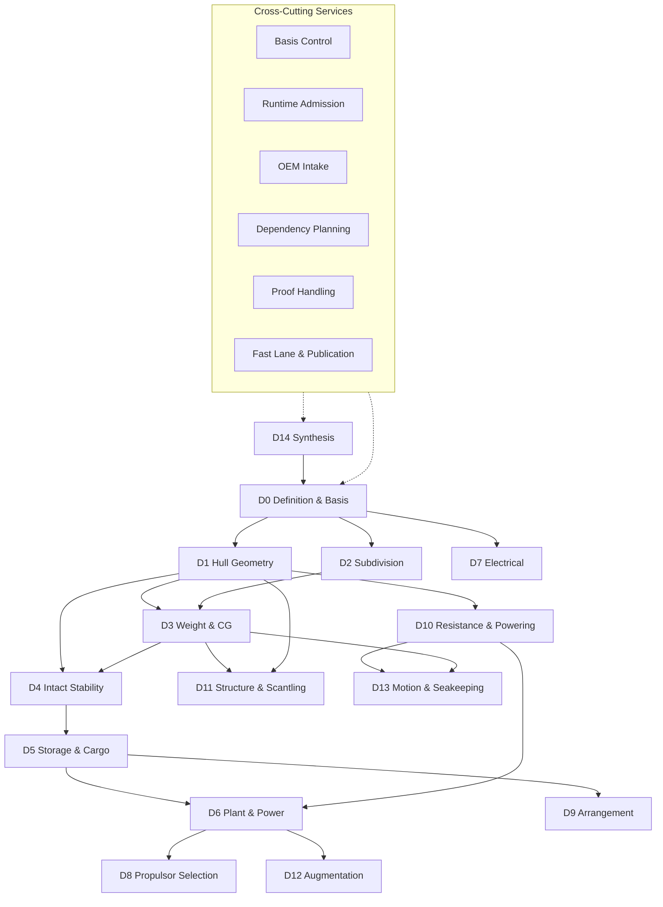

# Platform Overview — Diagram

## ZeroShip Platform Architecture

## Text Description

The platform is organised as a directed graph of fifteen engineering dimensions (D0–D14) connected by data dependencies.

**Entry point:** D0 (Definition and Basis) provides the frozen vessel state that all other dimensions consume.

**Core flow:**
- D0 feeds D1 (Hull Geometry) and D2 (Subdivision)
- D1 and D2 feed D3 (Weight and Centre of Gravity)
- D3 and D1 feed D4 (Intact Stability)
- D4 feeds D5 (Storage and Cargo)
- D5 feeds D6 (Plant and Power) alongside D10 (Resistance)
- D1 feeds D10 (Resistance and Powering)
- D6 feeds D8 (Propulsor Selection) and D12 (Augmentation)
- D3 and D1 feed D11 (Structure and Scantling)
- D10 and D3 feed D13 (Motion and Seakeeping)

**Closure:** D14 (Synthesis) aggregates all dimension outputs and feeds back to D0, creating information for the next spiral iteration.

**Cross-cutting services** (basis control, runtime admission, OEM intake, dependency planning, proof handling, fast lane and publication) operate across all dimensions rather than within any single stage. See [CROSS-CUTTING-SERVICES.md](../CROSS-CUTTING-SERVICES.md) for details.

**Current state:** D13 (Motion and Seakeeping) is blocked pending OpenFOAM runtime binding. All other dimensions are operational or have framework support. See [DEVELOPMENT-STATUS.md](../DEVELOPMENT-STATUS.md) for live status.
